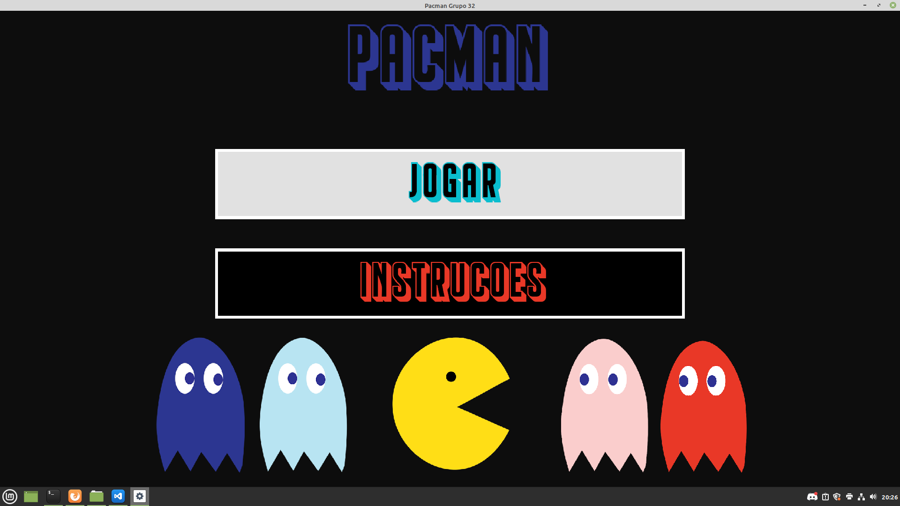
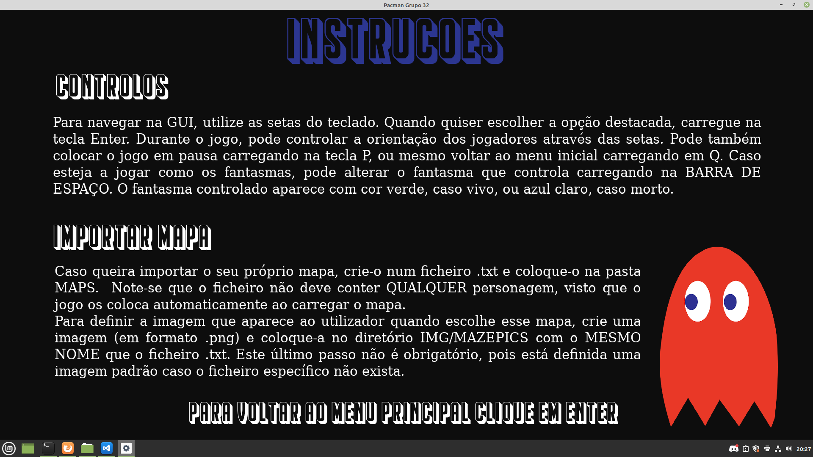
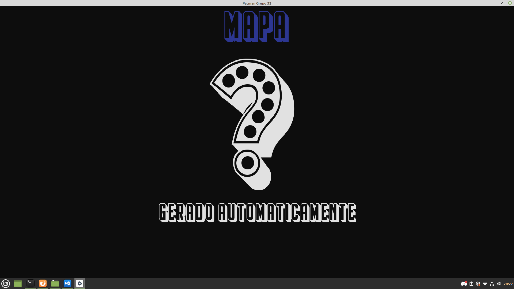
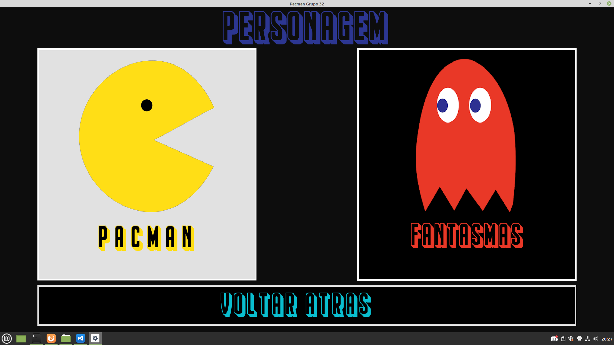
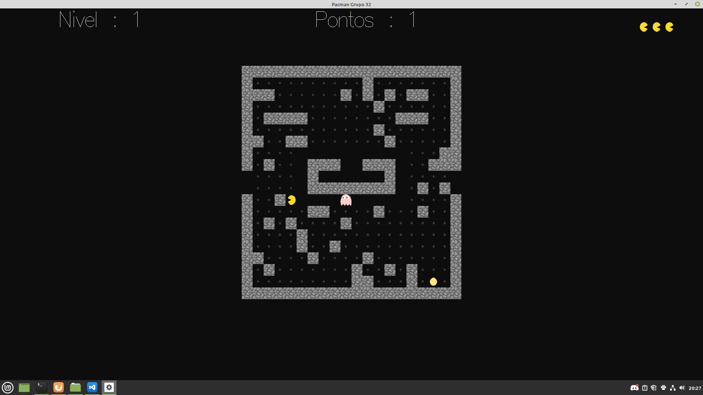

# Pacman
Project developed by  [Rui Oliveira](https://github.com/ruioliveira02) and [Tiago Bacelar](https://github.com/tiago-bacelar) for the subject of IT Laboratories I, from the year 2020/2021, of the Master's Degree in IT Engineering of University of Minho.

The project was written in Haskell, using the [Gloss library](https://hackage.haskell.org/package/gloss) for the 2D graphics, and was evaluated with a 20, i.e., the maximum possible grade.

# Project Overview
## Features

The features that set this project apart from the others are:

- Its pretty UI
- Ability to play as the ghosts
- Ability to play on randomly generated mazes
- Ability to import custom made mazes

## Main tasks
The project was divided into six different tasks (tarefas, in Portuguese), plus the GUI design, which was not compulsory. 

In the first task (`Tarefa1`), we were to implement a random maze generation algorithm. Our code not only produces a valid maze, but also insures that every food can be reached by the Pacman, which was not required, however, it was implemented as it was deemed important to the overall gameplay experience using such mazes.

In `Tarefa2`, the core of the game logic was implemented, i.e, the effects of a certain movement by one of the characters (Ghost or Pacman) in the state of the game.

In `Tarefa3` a maze compression tool was implemented. This was, however, not used throughout the rest of the assignment.

`Tarefa4` implements of effect of time in the game, i.e, it takes into consideration the index of the current iteration of the game loop, and moves the players accordingly (for example, players with a speed of half would only move in even iterations). It was decided that all players would move in the direction they were facing. Rotating them to the correct orientation, therefore, is to be done elsewhere in the code.

In `Tarefa5`, the ghost AI was implemented. There are two types of ghosts: type one tries to reach the square the Pacman is in, whilst type two aims for the square four places (at most) ahead of the Pacman's current location. Either way, they all travel through the shortest possible path. The computing of such paths is carried out by the `Memoization` module, taking advantage of Haskell's laziness.

Finally, `Tarefa6` implements the Pacman bot. The bot uses a search algorithm, running through every possible sequence of moves (up to a fixed depth of 5), and computes the most advantageous for itself. Naturally, dynamic programming was implemented to avoid computing the same states twice.

## GUI
In order to overcome some limitations of Gloss (like text rendering), most of the text displayed is an image (hence the large volume of files in the `img` folder).

Each menu has been given each independent file and consists of two main functions: the first one computes the `Picture`which has to be displayed, and the other one reacts to key inputs from the user.

# Screenshots

# Further work

In order to further improve the project, one could implement sounds (although it would require major refactoring), improve the efficiency of the bot and of `Tarefa1`, which was not possible due to type constraints given by the project statement.

